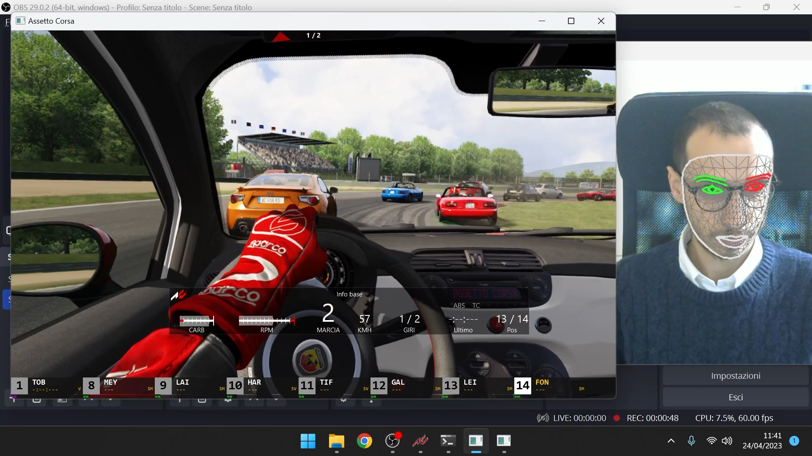

# Nose Drive #
Simulate Xbox360 controller or mouse/keyboard inputs using [Mediapipe](https://developers.google.com/mediapipe/solutions/guide) tracking of Face joints.

This project is realized by the non-profit "ASPHI Onlus" and its main purpose is to help people with complex motor disabilities play videogames through alternative and highly-customizable inputs solutions.

Nose Drive provides a Python library that can be used to easily bind face movements to gamepad/keyboard/mouse buttons pressed by a virtual device.

AUTHORS: [ASPHI Onlus](https://asphi.it/games)

## Demo video ##

## Quick start with Nose Drive GUI - Desktop App ##
* Install the [ViGEmBus driver](https://github.com/ViGEm/ViGEmBus/releases)
* Download and install our [latest release](https://github.com/Fondazione-ASPHI/Nose-Drive/releases)
* Choose game mode and press the START button
* Stand still in front of the webcam in your base position for 3 seconds (can be edited)
* Start playing your game
* The "N" key on the keyboard can always be pressed to reset the base position to the actual position
* The "P" key pauses and resumes inputs simulation
* If the program does not run, try to install the [Visual C++ redistributable package](https://learn.microsoft.com/it-it/cpp/windows/latest-supported-vc-redist?view=msvc-170#visual-studio-2015-2017-2019-and-2022)

### Inputs ###
Core commands:
* NOSE DOWN: gamepad analog Right-Trigger (accelerator)
* NOSE UP: gamepad Left-Trigger (brake)
* NOSE RIGHT and LEFT: gamepad Left Analog Horizontal Axis (steer left and right)

### Settings ###
In the [drive_settings.json](https://github.com/Fondazione-ASPHI/Nose-Drive/blob/main/drive_settings.json) file you can modify:
* sensibility values for inputs
* how many seconds to wait, after the webcam image shows up, before the program takes your actual position as the base position (the pressure of the keys is based on the deviation from this base position)
* the index of the camera that should be used for tracking, if more than one cameras are connected (default is 0)
* the keyboard keys to trigger reset of base position or to pause the program

## Python library ##
Using the Nose Drive Python library it is possible to create custom scripts to customize control of different kind of videogames (Platforms, 3D movement, ...). Examples of such scripts can be found inside the [test](tests/) folder.

[In the wiki](https://github.com/Fondazione-ASPHI/Nose-Drive/wiki), a detailed tutorial and documentation can be found.

## Mediapipe Documentation ##
[Python API examples](https://developers.google.com/mediapipe/solutions/vision/face_landmarker/python)

## Videogames Controller ##
### Driver ###
[Driver to Emulate Xbox360 Controller](https://github.com/ViGEm/ViGEmBus/releases)
### Python Libraries ###
* Simulate Xbox360 Controller inputs: [vgamepad](https://pypi.org/project/vgamepad/)
* Read keyboard inputs: [keyboard](https://github.com/boppreh/keyboard#api)
* Simulate keyboard inputs: [pynput](https://pypi.org/project/pynput/)

## Working with Conda and Python ##
* Install [Miniconda](https://docs.anaconda.com/free/miniconda/index.html)
* (Optional) You can add Anaconda prompt to right click menu following [these steps](https://gist.github.com/jiewpeng/8ba446acf329b1801bf91db767d179ea)
* Open Anaconda prompt and navigate to Nose Drive root folder
* conda create -n py310 python=3.10
* conda activate py310
* pip install -r requirements.txt
* Then you can execute every script with python, for example the command "python Drive.py drive_settings.json" will execute the Drive.py script with the settings defined in the file drive_settings.json

## Build instructions ##
* Download this [Embedded Python](https://github.com/Fondazione-ASPHI/Nose-Drive/releases/download/Python_Embedded/python_310.zip) (already tested and working for builds).
* .\python_310\Scripts\pyinstaller.exe .\Builder.spec
* Change line 6 of Builder.spec to match the .py script you want to build
* Execute compiled binaries with ".\dist\main\main.exe .\your_settings.json"

# Integrations #

## Voice Controls ##
[VOICE ATTACK](https://voiceattack.com/) software provides voice-activated control to simulate mouse/keyboard inputs and much more! This feature complements the nose drive very effectively, allowing to play many games that require a large number of inputs.

## Eye-Tracking ##
Thanks to [BEAM EYE TRACKER](https://beam.eyeware.tech/) we are now able to simulate gamepad and mouse/keyboard inputs by moving our eyes!
* [The scripts in this folder](Beam_Eyetracker_Scripts) make use of this amazing feature.
* Of course, it is possible to combine mediapipe tracking of facial joints with the Eye gaze tracking to achieve even more customization! Note that in order to execute this kind of scripts (for example [Eye_3rd_Gamepad.py](Beam_Eyetracker_Scripts/Eye_3rd_Gamepad.py)) a software like "[Split Cam](https://splitcam.com/)" is required, because the webcam image should go to both Beam Eyetracker software and Python CV2 library at the same time.

# License #
Exept where otherwise stated, the files in this repository were created by [Fondazione ASPHI Onlus](https://asphi.it/) and are licensed under a GNU GENERAL PUBLIC LICENSE.
* Files inside [eyeware folder](Beam_Eyetracker_Scripts/eyeware) are intellectual property of "Beam Eye Tracker", and are thus licensed under their terms (Eyeware Tech SA. All rights reserved).
* Files inside [VoiceAttack_Profiles folder](VoiceAttack_Profiles) were generated by the software [VoiceAttack](https://voiceattack.com/)

# Support #
For receiving support write to anorfo@asphi.it

# Credits #
A big "Thank you!" goes to
* the authors of [ViGEmBus](https://github.com/ViGEm/ViGEmBus) driver
* the authors of [Mediapipe](https://developers.google.com/mediapipe/) high-fidelity body pose tracking solution
* the authors of [vgamepad](https://pypi.org/project/vgamepad/) python library
* the authors of [keyboard](https://github.com/boppreh/keyboard) python library
* the authors of [pynput](https://pypi.org/project/pynput/) python library

on whose work our solution relies

## Special Mentions ##
* Thanks to [Matteo](https://github.com/Matteionicon12) for contributing on the GUI features.
* Thanks to [Tecnologicamente Insuperabili](https://www.tecnologicamenteinsuperabili.org/) for their feedbacks and for testing Nose-Drive on so many games.
